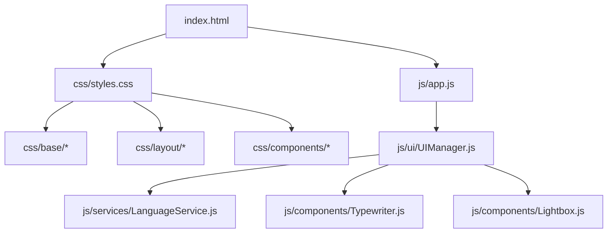

# 🏛️ Neko Void Web - Architecture Overview

This document describes the high-level architecture of the Neko Void Web landing page.

## System Flow

The page relies on a decoupled, modular design to ensure high performance, maintainability, and clean code separation.

## Key Concept: Separation of Concerns

1. **Markup (`index.html`):** Represents only the semantic structure of the DOM. No inline styles are allowed. Responsive scripts are loaded as ES Modules.
2. **Styles (`css/`):** Separated using a lightweight ITCSS/BEM-inspired structure. Elements are modularly imported, avoiding CSS overrides and conflicts.
3. **Logic (`js/`):** Deployed as ES Modules. Individual components manage their own DOM lifecycle, while the `UIManager` acts as the single orchestrator.
4. **Tooling (Vite):** Handles bundling, minification, tree-shaking, and static asset versioning automatically.
